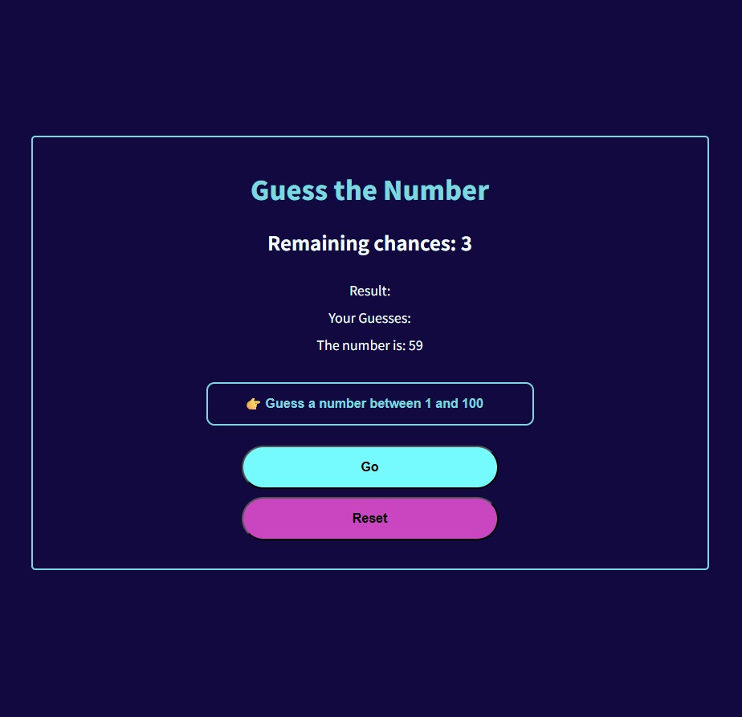

# Guess the Number Game

A simple number guessing game made with HTML, CSS and JavaScript.
Players try to guess the number generated by the computer within 3 chances.

## Features

- Random number generation (1-100)
- User input validation
- Up/Down hints
- Remaining chances tracking
- Previous guesses history
- Game over and reset functionality
- Responsive design for mobile and desktop

## How to Play
1. Enter a number between 1 and 100.
2. Click "Go" to submit your guess.
3. Check the hint (Up/Down) to adjust your next guess.
4. You have 3 chances to guess the correct number.
5. Click "Reset" to start a new game.

# Demo
